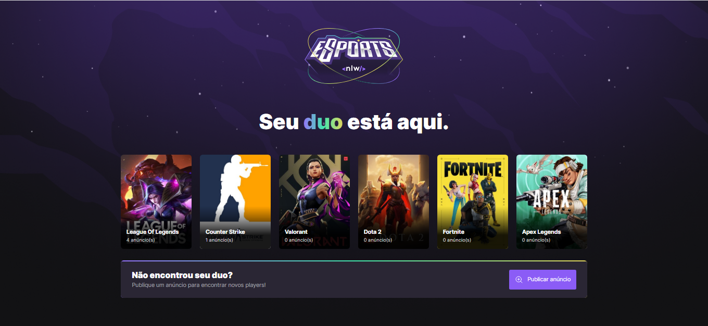
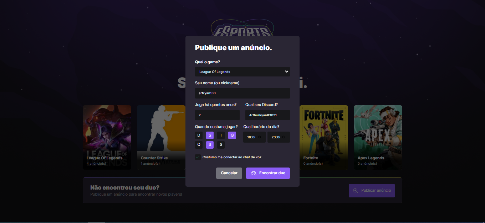
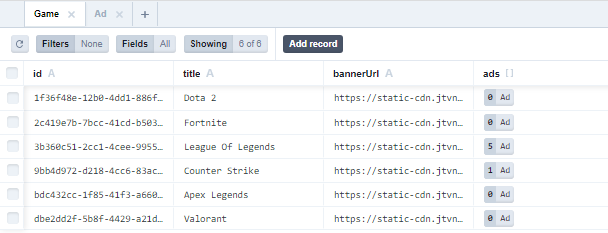
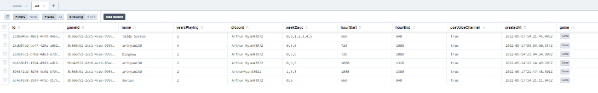

# NLW Esports

**Este projeto de uma rede social, guiada pela Rocktseat desenvolvido com Node.js, React, React Native e TypreScript. Bora codar** 🚀!




--- 




--- 





--- 



--- 

## Inicializando o servidor `./server` 

**Para utilizarmos todas as funcionalidades da aplicação, temos que primeiramente rodar nosso servidor. O servidor em questão foi desenvolvido utilizado o NodeJs.**

### Comando para instalação de todas as dependências

```jsx
npm install
```

### Comando para inicialização do servidor

```jsx
npm run dev
```

<aside>

---

## Incializando nossa aplicação `./web` 

**Agora que já configuramos o ambiente de back-end em node, podemos incializar nosso ambiente de app em React, vamos utilizar uma ferramenta muito conhecida, o [Vite.js](https://vitejs.dev/), que é uma ferramenta que usa as bibliotecas das mais atualizadas do JS, e ainda consegue ser mais performático que instalar padronizado no próprio React!**

### Comando para instalação de todas as dependências

```jsx
npm install
```

### Comando para inicialização da aplicação

```jsx
npm run dev
```

<aside>

---

## Inicializar app de `./native` 

**Agora que conseguimos fazer o app para web, ou desktop como chamar, iremos criar a configuração de building para mobile, pois queremos que ele esteja disponível em React Native para mobile! Para isso usaremos outra ferramenta que se adapta bem a mobile, que é a [Expo](https://expo.dev/)**

### Comando criação do app:

```jsx
expo install
```

### Comando para inicialização da aplicação

```jsx
expo start
```

<aside>
